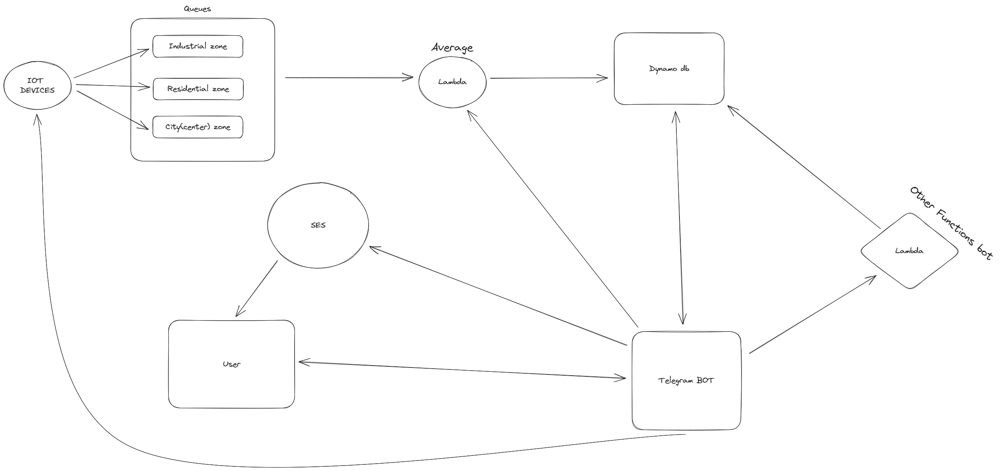

# EcoSenseNet EcoSenseNet: Pollution Monitoring System

EcoSenseNet is a project focused on collecting and analyzing data about pollution across multiple city zones. Pollution has become a pressing global concern, affecting the health and well-being of individuals, as well as the overall environmental balance. To effectively address this issue, it is essential to gather accurate and real-time data to identify pollution sources, monitor air quality, and implement targeted interventions.

## Architecture

There are some devices (simulated) that send datas to SQS queues and a lambda function that colud be triggered manually. This lambda does an average and saves datas on DynamoDB. All the datas are accessed by a Telegram bot. This bot can trigger IoT sensors and the lambda for store datas. It can also switch on or off sensors. It also offers a way to send recap emails to the user.

## Prerequisite
- docker
- Node.js
- A telegram bot token

## How to run this project

- clone this repo: <code>[repo link](https://github.com/simoneauriemma/EcoSenseNet.git)</code>
- run <code>docker run -d --rm -p 4566:4566 --name aws localstack/localstack:1.4</code>
- run <code>npm install</code>
- go into <code>deploy</code> and re-run the command above
- in the root directory run <code>npm run build</code>
- run <code>npm run start</code>
- run <code>npm run setup</code>
- run <code>.\copy.bat</code>
- verify your email with: <code>aws ses verify-email-identity --email-address <your-email> --endpoint-url="http://localhost:4566"</code>

After this, setup all the lamba functions:

- <code>aws iam create-role --role-name lambdarole --assume-role-policy-document file://role_policy.json --query 'Role.Arn' --endpoint-url=http://localhost:4566</code>
- <code> aws iam put-role-policy --role-name lambdarole --policy-name lambdapolicy --policy-document file://policy.json --endpoint-url=http://localhost:4566</code> 

And then create the functions:

- <code>aws lambda create-function --function-name average --zip-file fileb://functions.zip --handler deploy/average.lambdaHandler --runtime nodejs18.x --role arn:aws:iam::000000000000:role/lambdarole --endpoint-url=http://localhost:4566</code>

- <code>aws lambda create-function --function-name offsensors --zip-file fileb://functions.zip --handler deploy/offSensors.lambdaHandler --runtime nodejs18.x --role arn:aws:iam::000000000000:role/lambdarole --endpoint-url=http://localhost:4566</code>

- <code>aws lambda create-function --function-name onsensors --zip-file fileb://functions.zip --handler deploy/onSensors.lambdaHandler --runtime nodejs18.x --role arn:aws:iam::000000000000:role/lambdarole --endpoint-url=http://localhost:4566</code>
 
- <code>aws lambda create-function --function-name onsensorzone --zip-file fileb://functions.zip --handler deploy/onSensorZone.lambdaHandler --runtime nodejs18.x --role arn:aws:iam::000000000000:role/lambdarole --endpoint-url=http://localhost:4566</code>
  
- <code>aws lambda create-function --function-name offsensorzone --zip-file fileb://functions.zip --handler deploy/offSensorZone.lambdaHandler --runtime nodejs18.x --role arn:aws:iam::000000000000:role/lambdarole --endpoint-url=http://localhost:4566</code>

- start the bot by typing: <code>python bot/bot.py</code>
